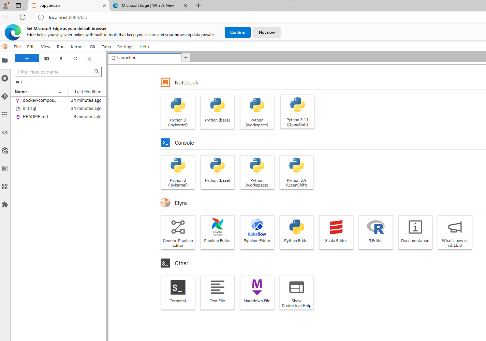

Building Custom Docker Container with PostgreSQL with pgvector

```bash
docker-compose up -d
```

## Local Setup

If we are interested to test this enviroment locally.

Let assume that you have anaconda.

## Step 1. Installation of Conda
First you need to install anaconda. In this location C:\Anaconda3 , then you, check that your terminal , recognize conda
```bash
C:\conda --version
conda 23.1.0
```
## Step 2. Environment creation
The environments supported that I will consider is Python 3.10,

I will create an environment called LLM, but you can put the name that you like.

```bash
conda create -n openshift python==3.11
```
then we activate

```bash
conda activate openshift
```
then in your terminal type the following commands:

```
python -m pip install --upgrade pip
````

```
conda install ipykernel notebook 
```

then
```
conda install -c conda-forge "elyra[all]"
```

```
python -m ipykernel install --user --name openshift --display-name "Python 3.11 (OpenShift)"
```

then we 

```
jupyter lab
```



### Creatioo of Local Postgresql
In this current directory we  should have installed Docker and just type 
```bash
docker-compose up -d
```

